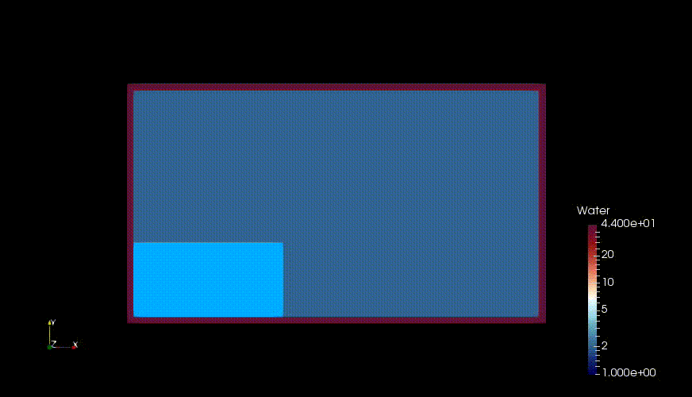

# Smoothed-Particle-Hydrodynamics
DJ Price's Concepts re-explained (see PDF)  

## Demonstration of WCSPH Simulation using in-house code (written in C++)  
       
### Classical Dam Break Problem (Visualisation using ParaView)

Author,  
Yogesh,  
IIT Madras.

