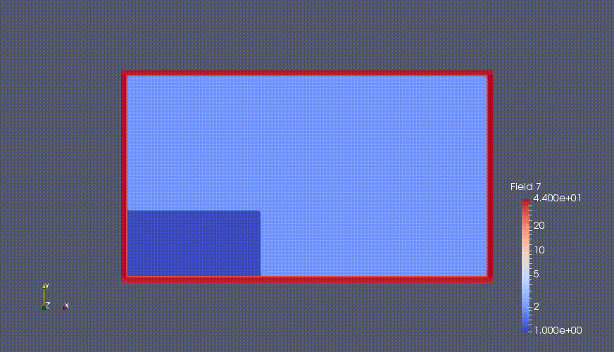

# Smoothed-Particle-Hydrodynamics
DJ Price's Concepts re-explained (see PDF)  

# Demonstration of Weakly Compressible SPH Simulation using in-house code (written in C++)  
       
## Classical Dam Break Problem (Visualisation using ParaView)

written by  
Yogesh,  
IIT Madras.

